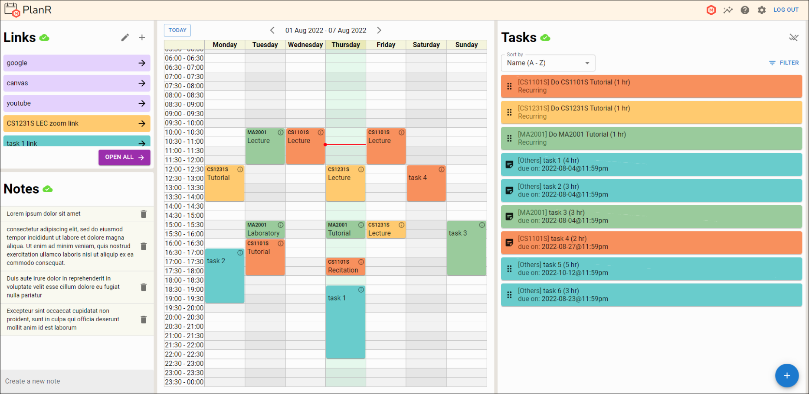

# PlanR

[PlanR](https://planr-orbital.netlify.app) is an interactive and responsive website that helps you plan your schedule more efficiently.

## Features

- Drag and drop tasks onto your timetable to schedule them
- Color-code tasks based on subject and type
- Access web links associated with your tasks
- View statistics on how you spent your time
- Import your [NUSMods](https://nusmods.com) timetable into PlanR using the NUSMods share link

## Tech Stack

- MERN
  - [MongoDB](https://www.mongodb.com)
  - [Express](https://expressjs.com)
  - [React](https://react.dev)
  - [Node.js](https://nodejs.org)
- [Redux](https://react-redux.js.org)
- [Material UI](https://mui.com/material-ui)

The front-end is hosted on [Netlify](https://www.netlify.com) while the back-end is hosted on [~~Heroku~~](https://www.heroku.com) [Render](https://render.com).

## Project Structure

- [GitHub repository for front-end code](https://github.com/rexcyrio/planr-front)
- [GitHub repository for back-end code](https://github.com/rexcyrio/planr-back)

## Milestone Reports

In our milestone reports, we share on our target audience, user stories, features, design choices, tech stack, various testing conducted, development plans, and project log.

- [Milestone 1 report](https://docs.google.com/document/d/1NoKy0co0kDOky7yAW9wh3ylhPuuvNzNLvNM-9O3rTDA)
- [Milestone 2 report](https://docs.google.com/document/d/1OcCyBzBgf0Dy5PeIfKMLBF2T4RFLMXmKsIhE-J6U4EI)
- [Milestone 3 report (final)](https://docs.google.com/document/d/1M-zp3v4NN0dnDNYOVMZTjzeT7V1nqucU8fTubLCxs0k)

## Splashdown Submission

- [Live website](https://planr-orbital.netlify.app)
- [Demo video](https://youtu.be/ccki3p1nzdo?list=PLLSECIsYjSIwLRWCruGapCHftSrGAPhmc)
- [Poster](https://drive.google.com/file/d/1td9zN11_imdD6b44G9agxm87ELuMs0Uj/view?usp=sharing)

## Authors

- [Lee Wei Chong Stefan](https://github.com/rexcyrio)
- [Tan Wei Zhe](https://github.com/wz2k)

## Notes

PlanR was developed during the NUS AY21/22 summer break for [Orbital](https://orbital.comp.nus.edu.sg) (a.k.a. *CP2106: Independent Software Development Project*)

Level of achievement: Apollo 11
